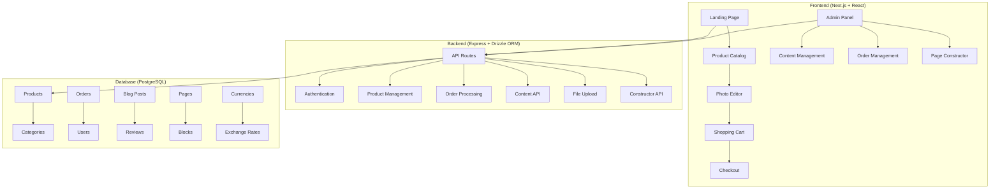

> Краткая ссылка: смотрите CONTEXT.md — актуальная сводка принятых решений и настроек (Фотокнига, Баннеры, Производительность, Сборка/инструменты).

# Анализ проекта "PhotoBooksGallery" - Полнофункциональное веб-приложение для создания фотокниг

## 📋 Обзор проекта

**PhotoBooksGallery** - это современное веб-приложение для создания и заказа персонализированных фотокниг. Проект представляет собой монолитную архитектуру на Next.js с Express сервером, поддерживающую мультиязычность и мультивалютность.

## 🏗️ Архитектурная схема

## 🎯 Ключевые функциональные возможности

### 1. Система конструктора страниц
- **Визуальный редактор** блоков (hero, text, image, gallery, button)
- **Мультиязычная поддержка** для всех контент-блоков
- **Drag-and-drop** интерфейс для управления порядком блоков
- **Предпросмотр** страниц в реальном времени

### 2. Фоторедактор
- **Автоматическая раскладка** фотографий на 10 разворотов
- **Загрузка изображений** с поддержкой JPG, PNG, HEIC
- **Навигация** между разворотами
- **Экспорт проекта** для заказа

### 3. Административная панель
- **Управление товарами** с детальными параметрами фотокниг
- **Управление категориями** с мультиязычными названиями
- **Система отзывов** с модерацией и промо-отзывами
- **Управление блогом** со статусами публикации
- **Аналитика** и статистика продаж
- **Управление валютами** и курсами обмена

### 4. Электронная коммерция
- **Мультивалютность** (USD, RUB, AMD) с автоматическим пересчетом
- **Система скидок** и промокодов
- **Управление заказами** с различными статусами
- **Корзина покупок** и процесс оформления заказа

## 🗃️ Структура базы данных

### Основные таблицы:
- **products** - товары с параметрами фотокниг
- **categories** - категории товаров
- **orders** - заказы клиентов
- **users** - пользователи системы
- **blog_posts** - статьи блога
- **reviews** - отзывы клиентов
- **currencies** - валюты и курсы обмена
- **pages** - страницы конструктора
- **blocks** - блоки контента

## 🌐 Мультиязычная архитектура

### Поддерживаемые языки:
- **Русский** (ru) - основной язык
- **Армянский** (hy) - локальный язык
- **Английский** (en) - международный язык

### Реализация:
- JSONB поля в базе данных для мультиязычного контента
- React i18n для фронтенд перевода
- Автоматическое определение языка пользователя

## 💰 Мультивалютная система

### Поддерживаемые валюты:
- **AMD** (Армянский драм) - базовая валюта
- **USD** (Доллар США) - международная валюта
- **RUB** (Российский рубль) - региональная валюта

### Особенности:
- Автоматический пересчет цен по текущим курсам
- Ручное управление курсами обмена
- Сохранение курса на момент заказа

## 🛠️ Технологический стек

### Frontend:
- **Next.js 14** - фреймворк React
- **TypeScript** - типизированный JavaScript
- **TanStack Query** - управление состоянием API
- **React Hook Form** - формы с валидацией
- **Zod** - валидация схем данных
- **Tailwind CSS** - utility-first CSS framework
- **Radix UI** - компоненты доступности

### Backend:
- **Express.js** - серверный фреймворк
- **Drizzle ORM** - современный ORM для PostgreSQL
- **PostgreSQL** - реляционная база данных
- **Zod** - валидация на сервере

### Инфраструктура:
- **Vercel/Netlify** - хостинг фронтенда
- **Railway/Heroku** - хостинг бэкенда
- **Amazon S3/Google Cloud Storage** - хранение файлов

## 📊 Статистика проекта

- **~850 строк** схемы базы данных
- **~1000 строк** компонента управления товарами
- **~700 строк** системы конструктора страниц
- **~500 строк** компонента отзывов
- **~400 строк** компонента блога

## 🚀 Потенциал для развития

### Ближайшие улучшения:
1. **Интеграция с платежными системами** (Stripe, PayPal)
2. **Email уведомления** о статусе заказов
3. **API для мобильных приложений**
4. **Система шаблонов** фотокниг
5. **AI-ассистент** для подбора дизайна

### Долгосрочные цели:
1. **PWA приложение** для мобильных устройств
2. **Социальные функции** - делиться проектами
3. **Партнерская программа**
4. **Интеграция с фотосервисами** (Google Photos, Instagram)

## 🔧 Рекомендации по разработке

### Приоритетные задачи:
1. **Тестирование** - добавить Jest/Cypress тесты
2. **Оптимизация** - lazy loading изображений
3. **Безопасность** - валидация всех входных данных
4. **Документация** - Swagger для API

### Архитектурные улучшения:
1. **Микросервисы** - разделить монолит на сервисы
2. **Кэширование** - Redis для частых запросов
3. **Очереди задач** - для фоновых процессов
4. **Мониторинг** - логирование и метрики

---

*Анализ выполнен на основе изучения исходного кода проекта. Все рекомендации основаны на лучших практиках современной веб-разработки.*